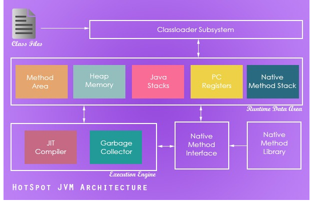
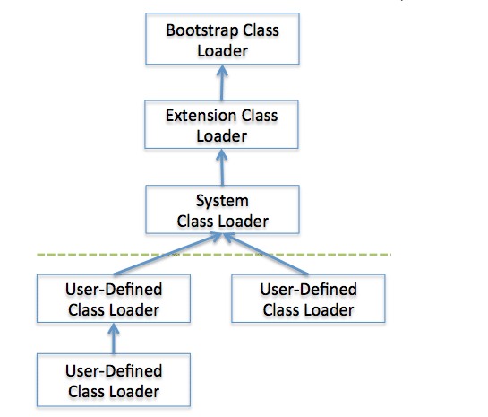

##### JVM，ART，Dalvik

- JVM：Java 虚拟机；类加载器 classloader + 执行引擎 execution engine + 运行时数据区域 runtime data area；
  - 程序计数器：当前线程所执行的字节码的行号指示器，用于记录下一条要运行的指令，线程私有（如果正在执行的是Native方法，计数器值则为空）
  - 虚拟机栈：对象的引用、方法出口等，线程私有
  - 本地方法栈：和虚拟栈相似，只不过它服务于Native方法，线程私有
  - 堆：java内存最大的一块，所有对象实例、数组都存放在java堆，GC回收的地方，线程共享
  - 方法区：存放已被加载的类信息、常量、静态变量、即时编译器编译后的代码数据等。（即永久带），回收目标主要是常量池的回收和类型的卸载，各线程共享

.png)

- Classloader：类加载器

  - 加载class方式
    - 隐式：运行过程中，碰到new方式生成对象时，隐式调用classLoader到JVM
    - 显式：通过class.forname()动态加载
  - 双亲委派模型（Parent Delegation Model）：类的加载过程采用双亲委托机制，这种机制能更好的保证 Java 平台的安全。该模型要求除了顶层的Bootstrap class loader启动类加载器外，其余的类加载器都应当有自己的`父类加载器`。子类加载器和父类加载器`不是以继承（Inheritance）的关系`来实现，而是通过`组合（Composition）关系`来复用父加载器的代码。每个类加载器都有自己的命名空间（由该加载器及所有父类加载器所加载的类组成，在同一个命名空间中，不会出现类的完整名字（包括类的包名）相同的两个类；在不同的命名空间中，有可能会出现类的完整名字（包括类的包名）相同的两个类）
    - Bootstrap Class Loader：是虚拟机的一部分， 主要加载JVM自身工作需要的类，完全由JVM控制，开发者无法访问.(无法被Java代码引用)；将指定目录下的符合虚拟机规范的类加载到虚拟机内存中，默认是\lib
    - Extension Class Loader：负责加载\lib\ext目录中的，或者被java.ext.dirs系统变量所指定的路径中的所有类库，开发者可以直接使用拓展类加载器
    - App Class Loader：由于这个类加载器是getSystemClassLoder()方法的返回值，所以又称系统加载器 ,它负责加载classPath路径上的指定的类库 ,如果程序中没有定义过类加载器，一般作为默认的类加载器

  

- Java内存堆与栈的区别

  - 栈内存用来存储基本类型的变量和对象的引用变量，堆内存用来存储Java中的对象，无论是成员变量，局部变量，还是类变量，它们指向的对象都存储在堆内存中
  - 栈内存归属于单个线程，每个线程都会有一个栈内存，其存储的变量只能在其所属线程中可见，即栈内存可以理解成线程的私有内存，堆内存中的对象对所有线程可见。堆内存中的对象可以被所有线程访问
  - 如果栈内存没有可用的空间存储方法调用和局部变量，JVM会抛出java.lang.StackOverFlowError，如果是堆内存没有可用的空间存储生成的对象，JVM会抛出java.lang.OutOfMemoryError
  - 栈的内存要远远小于堆内存，如果你使用递归的话，那么你的栈很快就会充满，-Xss选项设置栈内存的大小，-Xms选项可以设置堆的开始时的大小

- Java四种引用

  - 强引用（StrongReference）：强引用是使用最普遍的引用。如果一个对象具有强引用，那垃圾回收器绝不会回收它。当内存空间不足，Java虚拟机宁愿抛出OutOfMemoryError错误，使程序异常终止，也不会靠随意回收具有强引用的对象来解决内存不足的问题
  - 软引用（SoftReference）：如果内存空间不足了，就会回收这些对象的内存。只要垃圾回收器没有回收它，软引用可以和一个引用队列（ReferenceQueue）联合使用，如果软引用所引用的对象被垃圾回收器
  - 回收，Java虚拟机就会把这个软引用加入到与之关联的引用队列中
  - 弱引用（WeakReference）：弱引用与软引用的区别在于：只具有弱引用的对象拥有更短暂的生命周期，在垃圾回收器线程扫描它所管辖的内存区域的过程中，一旦发现了只具有弱引用的对象，不管当前内存空间足够与否，都会回收它的内存。弱引用可以和一个引用队列（ReferenceQueue）联合使用，如果弱引用所引用的对象被垃圾回收，Java虚拟机就会把这个弱引用加入到与之关联的引用队列中
  - 虚引用（PhantomReference）：虚引用在任何时候都可能被垃圾回收器回收，主要用来跟踪对象被垃圾回收器回收的活动，被回收时会收到一个系统通知。虚引用与软引用和弱引用的一个区别在于：虚引用必须和引用队列 （ReferenceQueue）联合使用。当垃圾回收器准备回收一个对象时，如果发现它还有虚引用，就会在回收对象的内存之前，把这个虚引用加入到与之关联的引用队列中

- GC

  - GC标记算法：引用计数法；根搜索算法(可达性算法)

  - GC回收算法

    - 标记-清除法：标记出没有用的对象，然后一个一个回收掉

      缺点：标记和清除两个过程效率不高，产生内存碎片导致需要分配较大对象时无法找到足够的连续内存而需要触发一次GC操作

    - 复制算法: 按照容量划分二个大小相等的内存区域，当一块用完的时候将活着的对象复制到另一块上，然后再把已使用的内存空间一次清理掉

      缺点：将内存缩小为了原来的一半

    - 标记-整理法：标记出没有用的对象，让所有存活的对象都向一端移动，然后直接清除掉端边界以外的内

      优点：解决了标记- 清除算法导致的内存碎片问题和在存活率较高时复制算法效率低的问题

    - 分代回收：根据对象存活周期的不同将内存划分为几块，一般是新生代和老年代，新生代基本采用复制算法，老年代采用标记整理算法

- ART：ART代表Android Runtime,其处理应用程序执行的方式完全不同于Dalvik，Dalvik是依靠一个Just-In-Time(JIT)编译器去解释字节码。开发者编译后的应用代码需要通过一个解释器在用户的设备上运行，这一机制并不高效，但让应用能更容易在不同硬件和架构上运行。ART则完全改变了这套做法，在应用安装的时候就预编译字节码到机器语言，这一机制叫Ahead-Of-Time(AOT)编译。在移除解释代码这一过程后，应用程序执行将更有效率，启动更快

- Dalvik：它可以支持已转换为.dex(即Dalvik Executable)格式的Java应用程序的运行，.dex格式是专为Dalvik应用设计的一种压缩格式，适合内存和处理器速度有限的系统。Dalvik经过优化，允许在有限的内存中同时运行多个虚拟机的实例，并且每一个Dalvik应用作为独立的Linux进程执行，独立的进程可以防止在虚拟机崩溃的时候所有程序都被关闭